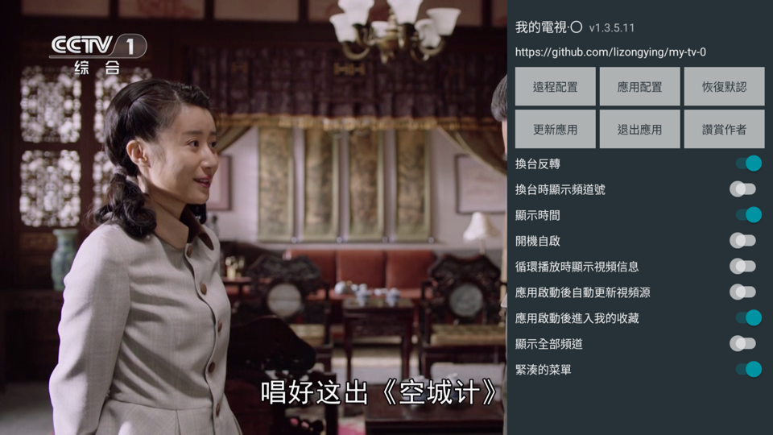
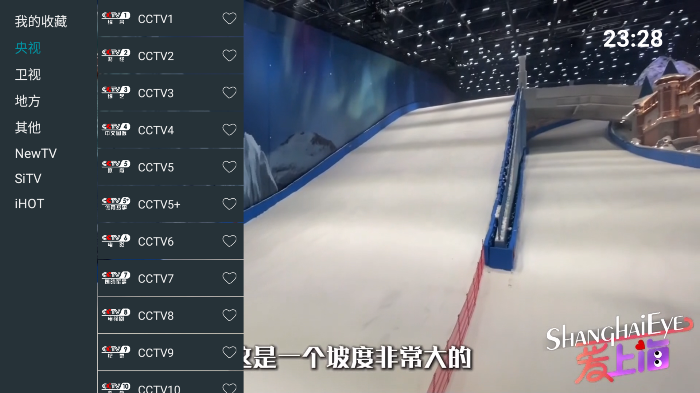

# 我的電視·〇

電視視頻播放軟件，可以自定義視頻源

[my-tv-0](https://github.com/lizongying/my-tv-0)

## 使用

* 遙控器左鍵/觸屏單擊打開視頻列表
* 遙控器右鍵/觸屏雙擊打開配置
* 遙控器返回鍵關閉視頻列表/配置
* 在聚焦視頻標題的時候，右鍵收藏/取消收藏
* 打開配置后，選擇遠程配置，掃描二維碼可以配置視頻源等。也可以直接遠程配置地址 http://0.0.0.0:34567
* 如果視頻源地址已配置，並且打開了“應用啟動后更新視頻源”后，應用啟動后會自動更新視頻源
* 默認遙控器下鍵/觸屏下滑切換到下一個視頻。換台反轉打開後，邏輯相反

注意：

* 遇到問題可以先考慮重啟/恢復默認/清除數據/重新安裝等方式自助解決
* 如果APP運行在手機上，建議在其他設備上進行遠程配置
* 視頻源可以設置為本地文件，格式如：file:///mnt/sdcard/tmp/channels.m3u
  /channels.m3u

目前支持的配置格式：

* txt
    ```
    組名,#genre#
    標題,視頻地址
    ```
* m3u
    ```
    #EXTM3U
    #EXTINF:-1 tvg-name="標準標題" tvg-logo="图标" group-title="組名",標題
    視頻地址
    ```
* json
    ```json
    [
      {
        "group": "組名",
        "logo": "图标",
        "name": "標準標題",
        "title": "標題",
        "uris": [
          "視頻地址"
        ],
        "headers": {
          "user-agent": ""
        }
      }
    ]
    ```

推薦配合使用 [my-tv-server](https://github.com/lizongying/my-tv-server)

下載安裝 [releases](https://github.com/lizongying/my-tv-0/releases/)

注意，“*-kitkat”為安卓4.4兼容版本

更多下載地址 [my-tv-0](https://lyrics.run/my-tv-0.html)





## 更新日誌

[更新日誌](./HISTORY.md)

## 其他

建議通過ADB進行安裝：

```shell
adb install my-tv-0.apk
```

小米電視可以使用小米電視助手進行安裝

## TODO

* 支持回看
* 詳細EPG
* 淺色菜單
* 無效的頻道？
* 如果上次播放頻道不在收藏？
* 當list為空，顯示group/空group不顯示？
* 默認頻道菜單顯示
* 遠程配置使用webView

## 讚賞


## 感謝

[live](https://github.com/fanmingming/live)