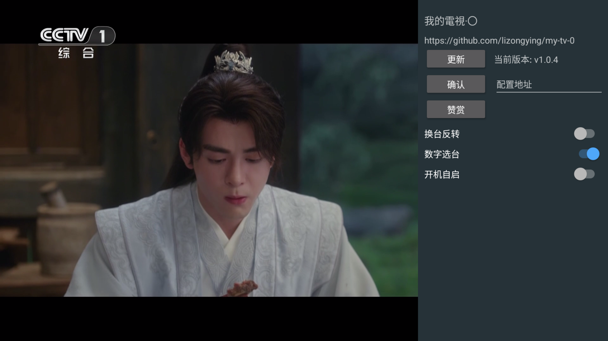

# 我的电视·〇

电视网络视频播放软件，可以自定义视频源

[my-tv-0](https://github.com/lizongying/my-tv-0)

## 使用

* 遥控器左键/触屏单击打开节目列表
* 遥控器右键/触屏双击打开配置
* 遥控器返回键关闭节目列表/配置
* 打开配置页后，配置地址后并确认，更新节目列表
* 配置了视频源地址，并且打开了“启动后自动更新视频源”后，软件启动后自动更新视频源
* 在节目列表显示的时候，右键收藏/取消收藏

注意：

* 视频源可以设置为本地文件，格式如：file:///mnt/sdcard/tmp/channels.m3u
  /channels.m3u
* 如果设置的是本地文件，则软件重新启动后不会自动更新。需要手动确认。
* 高版本可能需要授权

目前支持的配置格式：

* txt
    ```
    组名,#genre#
    标题,视频地址
    ```
* m3u
    ```
    #EXTM3U
    #EXTINF:-1 tvg-name="标准标题" tvg-logo="图标" group-title="组名",标题
    视频地址
    ```
* json
    ```json
    [
      {
        "group": "组名",
        "logo": "图标",
        "name": "标准标题",
        "title": "标题",
        "uris": [
          "视频地址"
        ],
        "headers": {
          "user-agent": ""
        }
      }
    ]
    ```

推荐配合使用 [my-tv-server](https://github.com/lizongying/my-tv-server)

下载安装 [releases](https://github.com/lizongying/my-tv-0/releases/)

更多地址 [my-tv](https://lyrics.run/my-tv-0.html)




## 更新日志

[更新日志](./HISTORY.md)

## 其他

小米电视可以使用小米电视助手进行安装

如电视可以启用ADB，也可以通过ADB进行安装：

```shell
adb install my-tv-0.apk
```

## TODO

* 节目增加预告
* 兼容4.0
* 插件商城
* UI
* 视频解码
* 支持回看

## 赞赏

